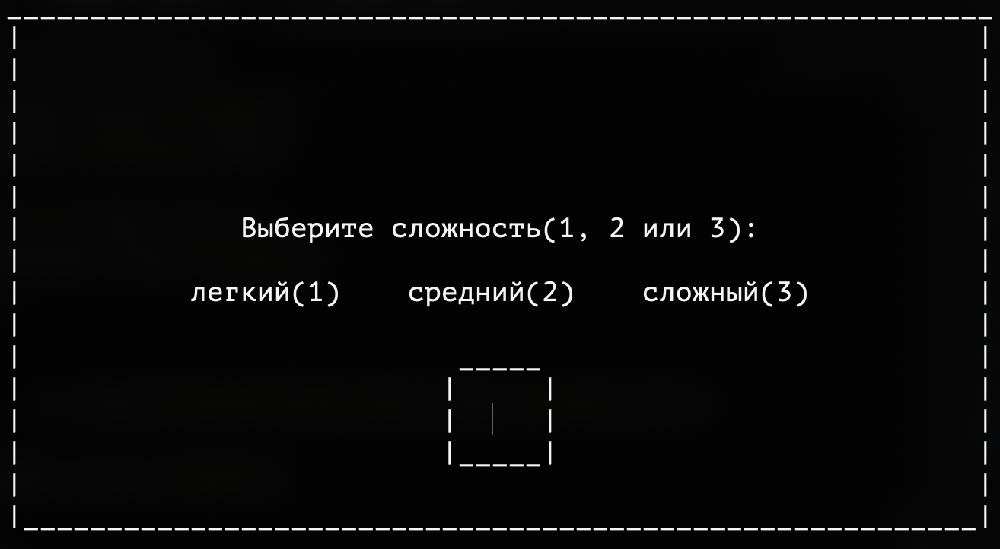
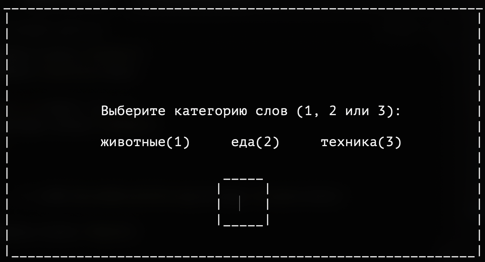
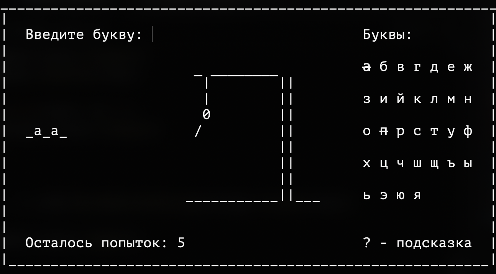
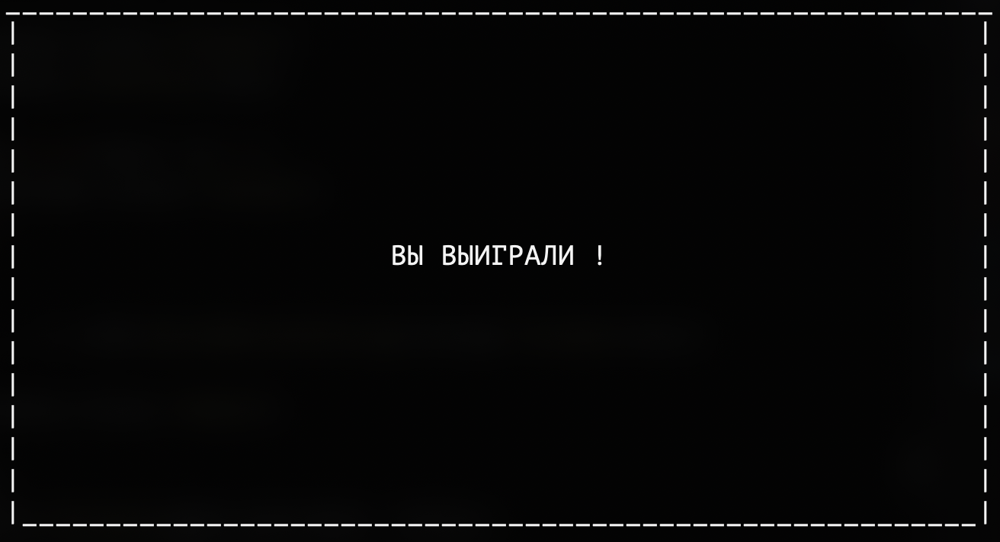

# 🪓 Виселица — консольная игра на Go

Классическая игра "Виселица", реализованная для терминала на языке Go. Угадывай слово по буквам, пока не исчерпаешь все попытки! Поддержка категорий, уровней сложности, визуализации виселицы и управление игровым состоянием.

---

## 🧩 Возможности
- 📚 Несколько категорий слов (животные, еда, техника)
- 🌟 Уровни сложности: лёгкий, средний, сложный
- 🔀 Случайный выбор категории и уровня сложности (при пропуске выбора категории и уровня)
- 🧠 Угадывание слова по одной букве (без учёта регистра)
- ❌ Проверка на некорректный ввод (только одна буква)
- 📉 Ограниченное число попыток, зависящее от сложности
- 🎨 Постепенная отрисовка виселицы (ASCII-графика)
- 📺 Отображение текущего состояния слова и введённых букв
- 🏆 Завершение игры при победе или поражении

---

## 🛠 Установка и запуск

### Способ 1:

```bash
git clone https://github.com/andreylikhterman/hangman-game.git
```
```bash
cd hangman-game
```
```bash
go run cmd/game/main.go
```

### Способ 2:

```bash
git clone https://github.com/andreylikhterman/hangman-game.git
```

```bash
cd hangman-game
```

```bash
make build
```

```bash
./bin/game
```
---

## 📸 Пример игрового процесса






---
